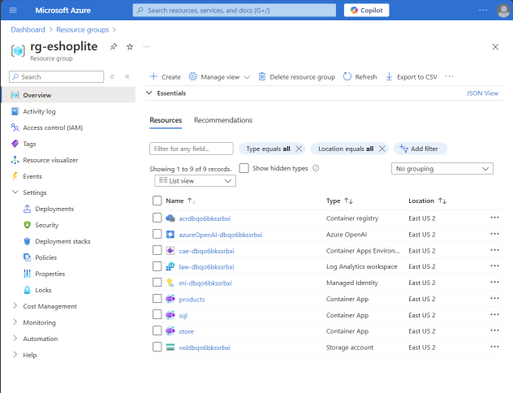
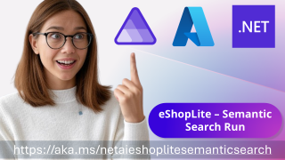

[](/LICENSE)
[](https://twitter.com/elbruno)


## Description

**eShopLite - Semantic Search** is a reference .NET application implementing an eCommerce site with Search features using Keyword Search and Semantic Search. This sample specifically demonstrates the integration of the **DeepSeek-R1** model for enhanced semantic understanding and search capabilities.

The reference application is part of the **[Generative AI for Beginners .NET](https://aka.ms/genainnet)** series, which aims to provide practical examples and resources for developers interested in generative AI.

- [Features](#features)
- [Architecture diagram](#architecture-diagram)
- [Getting started](#getting-started)
- [Deploying to Azure](#deploying)
- Run solution
  - [Run locally](#run-locally)
  - [Run the solution](#run-the-solution)
  - [.NET Aspire Azure Resources creation](#net-aspire-azure-resources-creation)
  - [Local dev using an existing model](#local-development-using-an-existing-gpt-4o-model)
  - [Telemetry with .NET Aspire and Azure Application Insights](#telemetry-with-net-aspire-and-azure-application-insights)
- [Resources](#resources)
- [Video Recordings](#video-recordings)
- [Guidance](#guidance)
  - [Costs](#costs)
  - [Security Guidelines](#security-guidelines)
- [Resources](#resources)

## Features

**GitHub CodeSpaces:** This project is designed to be opened in GitHub Codespaces as an easy way for anyone to deploy the solution entirely in the browser.

This is the eShopLite Aplication running, performing a **Semantic Search** using **deepseek-r1** model:


The Aspire Dashboard to check the running services:


The Azure Resource Group with all the deployed services:



## Architecture diagram

WIP - Coming soon!

## Getting Started

The solution is in the `./src` folder, the main solution is **[eShopLite-Aspire.sln](./src/eShopLite-Aspire.sln)**.

## Deploying

Once you've opened the project in [Codespaces](#github-codespaces), or [locally](#run-locally), you can deploy it to Azure.

From a Terminal window, open the folder with the clone of this repo and run the following commands.

1. Login to Azure:

    ```shell
    azd auth login
    ```

1. Provision and deploy all the resources:

    ```shell
    azd up
    ```

    It will prompt you to provide an `azd` environment name (like "eShopLite"), select a subscription from your Azure account, and select a [location where OpenAI the models gpt-4o-mini and ADA-002 are available](https://azure.microsoft.com/explore/global-infrastructure/products-by-region/?products=cognitive-services&regions=all) (like "**eastus2**" or "**swedencentral**").

1. When `azd` has finished deploying, you'll see the list of resources created in Azure and a set of URIs in the command output.

1. Visit the **store** URI, and you should see the **eShop Lite app**! 🎉

***Note:** The deploy files are located in the `./src/eShopAppHost/infra/` folder. They are generated by the `Aspire AppHost` project.*

1. Get your deepseek-r1 connection string from Azure AI Foundry.

### GitHub CodeSpaces

- Create a new  Codespace using the `Code` button at the top of the repository.

- The Codespace creation process can take a couple of minutes.

- Once the Codespace is loaded, it should have all the necessary requirements to deploy the solution.

### Run Locally

To run the project locally, you'll need to make sure the following tools are installed:

- [.NET 9](https://dotnet.microsoft.com/downloads/)
- [Git](https://git-scm.com/downloads)
- [Azure Developer CLI (azd)](https://aka.ms/install-azd)
- [Visual Studio Code](https://code.visualstudio.com/Download) or [Visual Studio](https://visualstudio.microsoft.com/downloads/)
  - If using Visual Studio Code, install the [C# Dev Kit](https://marketplace.visualstudio.com/items?itemName=ms-dotnettools.csdevkit)
- .NET Aspire workload:
    Installed with the [Visual Studio installer](https://learn.microsoft.com/en-us/dotnet/aspire/fundamentals/setup-tooling?tabs=windows&pivots=visual-studio#install-net-aspire) or the [.NET CLI workload](https://learn.microsoft.com/en-us/dotnet/aspire/fundamentals/setup-tooling?tabs=windows&pivots=visual-studio#install-net-aspire).
- An OCI compliant container runtime, such as:
  - [Docker Desktop](https://www.docker.com/products/docker-desktop/) or [Podman](https://podman.io/).

### Run the solution

Follow these steps to run the project, locally or in CodeSpaces:

- Navigate to the Aspire Host folder project using the command:

  ```bash
  cd ./src/eShopAppHost/
  ```

- Set the user secrets for the Azure OpenAI connection string as explained in the [Local development using existing models](#local-development-using-existing-models) section.

- Run the project:

  ```bash
  dotnet run
  ````

### Local development using existing models

In order to use existing models: deepseek-r1, gpt-4o-mini and text-embedding-ada-002, you need to define the specific connection string in the `Products` project.

Add a user secret named `ConnectionStrings:openai` with the configuration for the Azure OpenAI service that contains the **gpt-4o-mini** and **text-embedding-ada-002** models, and a user secret named `ConnectionStrings:deepseek-r1` with the configuration for the Azure OpenAI service that contains the **DeepSeek-R1** model.

```bash
cd src/Products

dotnet user-secrets set "ConnectionStrings:openai" "Endpoint=https://<endpoint>.openai.azure.com/;Key=<key>;"

dotnet user-secrets set "ConnectionStrings:deepseek-r1" "Endpoint=https://<endpoint>.openai.azure.com/;Key=<key>;"
```

This Azure OpenAI services must contain:

- a `deepseek-r1` model named **DeepSeek-R1**
- a `gpt-4o-mini` model named **gpt-4o-mini**
- a `text-embedding-ada-002` model named **text-embedding-ada-002**

To use these services, the `program.cs` will create a client in this way:

```csharp
var azureOpenAiClientName = "openai";
builder.AddAzureOpenAIClient(azureOpenAiClientName);
```

### DeepSeek-R1 Model Integration

This sample demonstrates the use of the **DeepSeek-R1** model for semantic search capabilities. DeepSeek-R1 is a powerful large language model that enhances the search experience by:

- Improving natural language understanding for more accurate search results
- Delivering enhanced context awareness for better product matching
- Processing complex search queries with greater precision
- Providing high-quality semantic embeddings for product data

The implementation showcases how modern AI models like DeepSeek-R1 can significantly improve e-commerce search experiences by understanding user intent beyond simple keyword matching.

### Telemetry with .NET Aspire and Azure Application Insights

The eShopLite solution leverages the Aspire Dashboard and Azure Application Insights to provide comprehensive telemetry and monitoring capabilities

The **.NET Aspire Dashboard** offers a centralized view of the application's performance, health, and usage metrics. It integrates seamlessly with the Azure OpenAI services, allowing developers to monitor the performance of the `gpt-4o-mini` and `text-embedding-ada-002` models. The dashboard provides real-time insights into the application's behavior, helping to identify and resolve issues quickly.


**Azure Application Insights** complements the Aspire Dashboard by offering deep diagnostic capabilities and advanced analytics. It collects detailed telemetry data, including request rates, response times, and failure rates, enabling developers to understand how the application is performing under different conditions. Application Insights also provides powerful querying and visualization tools, making it easier to analyze trends and detect anomalies. 


By combining the Aspire Dashboard with Azure Application Insights, the eShopLite solution ensures robust monitoring and diagnostics, enhancing the overall reliability and performance of the application.

## Guidance

### Costs

For **Azure OpenAI Services**, pricing varies per region and usage, so it isn't possible to predict exact costs for your usage.
The majority of the Azure resources used in this infrastructure are on usage-based pricing tiers.
However, Azure Container Registry has a fixed cost per registry per day.

You can try the [Azure pricing calculator](https://azure.com/e/2176802ea14941e4959eae8ad335aeb5) for the resources:

- Azure OpenAI Service: S0 tier, gpt-4o-mini and text-embedding-ada-002 models. Pricing is based on token count. [Pricing](https://azure.microsoft.com/pricing/details/cognitive-services/openai-service/)
- Azure Container App: Consumption tier with 0.5 CPU, 1GiB memory/storage. Pricing is based on resource allocation, and each month allows for a certain amount of free usage. [Pricing](https://azure.microsoft.com/pricing/details/container-apps/)
- Azure Container Registry: Basic tier. [Pricing](https://azure.microsoft.com/pricing/details/container-registry/)
- Log analytics: Pay-as-you-go tier. Costs based on data ingested. [Pricing](https://azure.microsoft.com/pricing/details/monitor/)
- Azure Application Insights pricing is based on a Pay-As-You-Go model. [Pricing](https://learn.microsoft.com/azure/azure-monitor/logs/cost-logs).

⚠️ To avoid unnecessary costs, remember to take down your app if it's no longer in use, either by deleting the resource group in the Portal or running `azd down`.

### Security Guidelines

Samples in this templates uses Azure OpenAI Services with ApiKey and [Managed Identity](https://learn.microsoft.com/entra/identity/managed-identities-azure-resources/overview) for authenticating to the Azure OpenAI service.

The Main Sample uses Managed Identity](https://learn.microsoft.com/entra/identity/managed-identities-azure-resources/overview) for authenticating to the Azure OpenAI service.

Additionally, we have added a [GitHub Action](https://github.com/microsoft/security-devops-action) that scans the infrastructure-as-code files and generates a report containing any detected issues. To ensure continued best practices in your own repository, we recommend that anyone creating solutions based on our templates ensure that the [Github secret scanning](https://docs.github.com/code-security/secret-scanning/about-secret-scanning) setting is enabled.

You may want to consider additional security measures, such as:

- Protecting the Azure Container Apps instance with a [firewall](https://learn.microsoft.com/azure/container-apps/waf-app-gateway) and/or [Virtual Network](https://learn.microsoft.com/azure/container-apps/networking?tabs=workload-profiles-env%2Cazure-cli).

## Resources

- [Deploy a .NET Aspire project to Azure Container Apps using the Azure Developer CLI (in-depth guide)](https://learn.microsoft.com/dotnet/aspire/deployment/azure/aca-deployment-azd-in-depth)

- [Aspiring .NET Applications with Azure OpenAI](https://learn.microsoft.com/shows/azure-developers-dotnet-aspire-day-2024/aspiring-dotnet-applications-with-azure-openai)

- [DeepSeek-R1 is now available on Azure AI Foundry and GitHub](https://azure.microsoft.com/en-us/blog/deepseek-r1-is-now-available-on-azure-ai-foundry-and-github/?msockid=1f1ab8a22fcf6b370b36add42e5b6aa3)

- [DeepSeek-R1 Model Card - Azure AI](https://ai.azure.com/explore/models/DeepSeek-R1/version/1/registry/azureml-deepseek?tid=e47e6fc9-3a2c-454a-8b8f-90cc6972fb77)

### Video Recordings

[](https://youtu.be/T9HwjVIDPAE)
